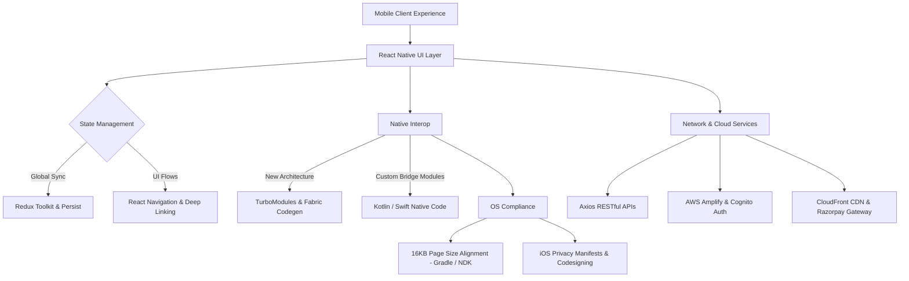

<div align="center">

  # 📱 Nitin Guttedar
  ### **Software Engineer — React Native & Cross-Platform Mobile Architect**

  <p align="center">
    <a href="https://git.io/typing-svg">
      
    </a>
  </p>

  <p align="center">
    📍 Kalaburagi / Mysuru, Karnataka, India &nbsp;|&nbsp;
    💼 Software Engineer @ <b>Excelsoft Technologies</b> &nbsp;|&nbsp;
    🚀 <b>3.6+ Years Exp</b>
  </p>

  <!-- Connect Badges -->
  <p align="center">
    <a href="mailto:nitinguttedar2000@gmail.com">
      
    </a>
    <a href="https://linkedin.com/in/nitin-guttedar">
      
    </a>
    <a href="https://github.com/nitin-guttedar">
      
    </a>
    <a href="tel:+919113533015">
      
    </a>
  </p>

  <!-- Metrics Highlight Strip -->
  <table align="center">
    <tr>
      <td align="center"><b>💼 Experience</b><br><code>3.6+ Years</code></td>
      <td align="center"><b>📱 Production Apps</b><br><code>3+ Enterprise & EdTech</code></td>
      <td align="center"><b>👥 Users Impacted</b><br><code>Tens of Thousands</code></td>
      <td align="center"><b>🎯 Production Quality</b><br><code>Near-Zero Critical Bugs</code></td>
      <td align="center"><b>⚙️ Architecture</b><br><code>New Arch / Fabric / 16KB</code></td>
    </tr>
  </table>

</div>

---

### 👨‍💻 About Me

Results-driven **Software Engineer** with **3.6+ years** of hands-on experience architecting, building, and deploying mission-critical cross-platform mobile applications using **React Native**, **TypeScript**, and **Redux Toolkit** across **iOS and Android**.

- 🔭 **Current Role:** Software Engineer at **Excelsoft Technologies Pvt Ltd**, driving cross-platform mobile engineering, native platform modernization, and deployment automation.
- 📱 **Store Deployment Owner:** Full ownership of App Store (Apple) & Google Play Store release pipelines, code signing, automated CI/CD builds, and compliance.
- ⚡ **Deep Native & Systems Focus:** Migrated production apps to React Native’s **New Architecture (Fabric, TurboModules, Codegen)**, eliminated bridge bottlenecks, and engineered **custom native modules (Kotlin/Java, Swift/Objective-C)**.
- 🛡️ **Play Store Compliance Pioneer:** Proactively addressed and resolved **16KB memory page size** ELF alignment across native C++ libraries ahead of Google Play enforcement deadlines.
- 🤝 **Leadership & Craft:** Regular code reviewer, technical mentor, and Agile team collaborator with a track record of zero post-launch critical bug releases.

---

### 🛠️ Tech Stack & Skills Matrix

<table>
  <tr>
    <td width="22%"><b>📱 Mobile Engineering</b></td>
    <td>
      
      
      
      
      
      
      
    </td>
  </tr>
  <tr>
    <td width="22%"><b>💻 Languages</b></td>
    <td>
      
      
      
      
    </td>
  </tr>
  <tr>
    <td width="22%"><b>⚛️ Frontend & State</b></td>
    <td>
      
      
      
      
      
      
    </td>
  </tr>
  <tr>
    <td width="22%"><b>☁️ Backend, APIs & Cloud</b></td>
    <td>
      
      
      
      
      
      
    </td>
  </tr>
  <tr>
    <td width="22%"><b>🚀 DevOps & Release</b></td>
    <td>
      
      
      
      
      
    </td>
  </tr>
  <tr>
    <td width="22%"><b>🛠️ Tooling & Profiling</b></td>
    <td>
      
      
      
      
      
      
      
    </td>
  </tr>
</table>

---

### 💼 Professional Experience

```
Excelsoft Technologies Pvt Ltd | Software Engineer
Mysuru, Karnataka, India | Feb 2023 – Present
```

- **Cross-Platform Mobile Leadership:** Spearhead end-to-end engineering of production mobile applications using **React Native** and **TypeScript**, shipping feature-rich releases for both iOS and Android from unified codebases.
- **Store Deployment & Compliance Ownership:** Lead complete lifecycle on **App Store Connect** and **Google Play Console**, handling code signing, automated certificate provisioning, privacy manifests, and store compliance.
- **New Architecture Modernization:** Spearheaded legacy application migration to React Native’s **New Architecture (Fabric renderer, TurboModules, Codegen)**, eliminating bridge serialization overhead and delivering near-instant native interop.
- **16KB Memory Page Size Alignment:** Prepared native Android build configurations and C++ shared libraries for Google Play's mandatory 16KB memory page size standard ahead of timeline.
- **Custom Native Module Engineering:** Built bespoke native modules in **Kotlin/Java** and **Swift/Objective-C** to replace heavy third-party npm packages, trimming bundle size and boosting performance.
- **Performance Profiling & Optimization:** Diagnosed JS thread bottlenecks with Flipper and Systrace, reducing Time-to-Interactive (TTI) and stabilizing 60 FPS animations on budget Android devices.
- **CI/CD & Release Automation:** Engineered automated CI/CD pipelines for automated unit testing, build artifact generation, and deployment pipelines.
- **Mentorship & Quality Standards:** Spearhead sprint code reviews, driving clean component architecture, strict TypeScript usage, and Redux state best practices.

---

### 🚀 Featured Production Apps

<table>
  <tr>
    <td width="33%" valign="top">
      <h3>🎓 JSSAHER OEP</h3>
      <i>Enterprise E-Learning Platform</i>
      <br><br>
      
      
      <br><br>
      <b>Impact & Contributions:</b>
      <ul>
        <li>Architected scalable app serving thousands of medical & healthcare students.</li>
        <li>Dynamic course curriculum rendering, progress tracking & React Navigation deep links.</li>
        <li>Optimized image caching & lazy loading for faster content retrieval.</li>
        <li><b>0 critical bugs</b> reported post-launch across iOS & Android.</li>
      </ul>
      <b>Stack:</b><br>
      <code>React Native</code> <code>TypeScript</code> <code>Redux Toolkit</code> <code>React Navigation</code> <code>Axios</code>
    </td>
    <td width="33%" valign="top">
      <h3>📚 Saksham Pro (ICICI)</h3>
      <i>Enterprise Learner Platform</i>
      <br><br>
      
      
      <br><br>
      <b>Impact & Contributions:</b>
      <ul>
        <li>Engineered course management UI & multi-step navigation for enterprise corporate groups.</li>
        <li>Refactored REST API data-fetching pipelines, reducing initial load latency significantly.</li>
        <li>Enforced strict client-side data privacy & platform compliance policies.</li>
        <li>Constructed reusable design system modules minimizing code redundancy.</li>
      </ul>
      <b>Stack:</b><br>
      <code>React Native</code> <code>Redux Toolkit</code> <code>RESTful APIs</code> <code>Axios</code> <code>React Navigation</code>
    </td>
    <td width="33%" valign="top">
      <h3>🚑 JeevaRaksha</h3>
      <i>Emergency Care & Medical LMS</i>
      <br><br>
      
      
      <br><br>
      <b>Impact & Contributions:</b>
      <ul>
        <li>Dual-role persona system (Student vs Instructor) with dynamic AWS Cognito/Amplify backends.</li>
        <li>Multi-format LMS video player (CloudFront MP4, YouTube, Vimeo, PDF manuals).</li>
        <li>Live resuscitation checklist module (BCLS/ACLS) for real-time instructor exam scoring.</li>
        <li>Integrated Razorpay gateway, dynamic PDF reports & offline Redux Persist storage.</li>
      </ul>
      <b>Stack:</b><br>
      <code>React Native</code> <code>TypeScript</code> <code>AWS Amplify</code> <code>Cognito</code> <code>CloudFront</code> <code>Razorpay</code>
    </td>
  </tr>
</table>

---

### ⚡ Architectural & Engineering Specializations



- **⚡ React Native New Architecture:** Fabric rendering pipeline, TurboModules, and JSI/Codegen implementation, eliminating bridge serialization bottlenecks.
- **🛡️ 16KB Page Size Android Compliance:** Hands-on experience rebuilding, aligning, and packaging native ELF libraries to support Android's 16KB page size requirement.
- **📶 Offline-First & Resilient Persistence:** Deep experience with Redux Persist, Secure Keychain/Encrypted Shared Preferences, and shimmer state loaders for degraded network environments.
- **🔐 Enterprise Security & Auth:** Role-based access control, AWS Cognito / Amplify auth state switching, payment gateway integration, and biometric/token protection.
  
---

### 🎓 Education & 🌐 Languages

<table width="100%">
  <tr>
    <td width="55%" valign="top">
      <h4>🎓 Academic Background</h4>
      <ul>
        <li>
          <b>Bachelor of Engineering (B.E.)</b> <br>
          <i>P.D.A. College of Engineering, Kalaburagi, Karnataka</i> <br>
          <code>Graduated: Jul 2022</code>
        </li>
        <li>
          <b>Pre-University Certificate (PUC) - Science</b> <br>
          <i>Sarvajna PU College of Science, Kalaburagi, Karnataka</i> <br>
          <code>Completed: Mar 2018</code>
        </li>
        <li>
          <b>Secondary School Leaving Certificate (SSLC)</b> <br>
          <i>Shahbaaz English Medium School, Kalaburagi, Karnataka</i> <br>
          <code>Completed: Apr 2016</code>
        </li>
      </ul>
    </td>
    <td width="45%" valign="top">
      <h4>🌐 Languages</h4>
      <ul>
        <li><b>English</b> — <i>Full Professional Proficiency</i></li>
        <li><b>Hindi</b> — <i>Full Professional Proficiency</i></li>
        <li><b>Kannada</b> — <i>Full Professional Proficiency</i></li>
      </ul>
      <br>
      <h4>🎯 Methodologies & Core Strengths</h4>
      <ul>
        <li>Agile / Scrum Sprints & JIRA</li>
        <li>Technical Mentoring & Code Reviews</li>
        <li>Pixel-Perfect Figma to Code Implementation</li>
        <li>Cross-Functional Collaboration</li>
      </ul>
    </td>
  </tr>
</table>

---

### 📬 Get In Touch

Whether you want to collaborate on an innovative mobile project, discuss React Native architecture, or explore high-impact engineering opportunities:

<p align="center">
  <a href="mailto:nitinguttedar2000@gmail.com">
    
  </a>
  <a href="https://linkedin.com/in/nitin-guttedar">
    
  </a>
  <a href="https://github.com/nitin-guttedar">
    
  </a>
  <a href="tel:+919113533015">
    
  </a>
</p>

<div align="center">
  <sub>Designed & engineered with ❤️ by <a href="https://github.com/nitin-guttedar">Nitin Guttedar</a></sub>
</div>
